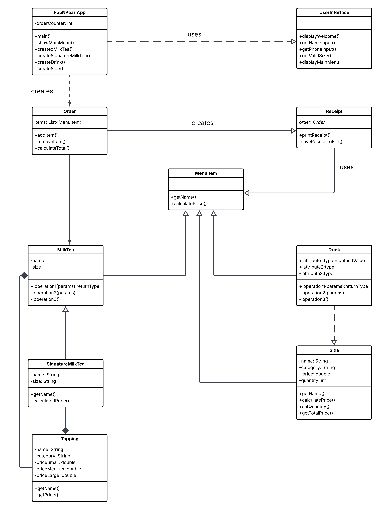

# 🧋 Pop N' Pearl - Bubble Tea Ordering System
A Java POS system for a boba shop where users can choose drinks, customize sizes and toppings, add items to an order, and automatically print a receipt to a text file.
## ✨ FEATURES ✨

- **Custom Milk Tea Builder** - Choose base tea, flavor, size, ice level, sugar level
- **Signature Drinks** - Pre-designed specialty drinks with automatic base selection
- **Smart Topping System** - Regular (free) vs Premium (paid) toppings
- **Receipts** - Automatic file saving with timestamps

## UML DIAGRAM

# INTERSTING CODE
I found this part of the program interesting because it generates a formatted receipt and writes it to a text file.
    

